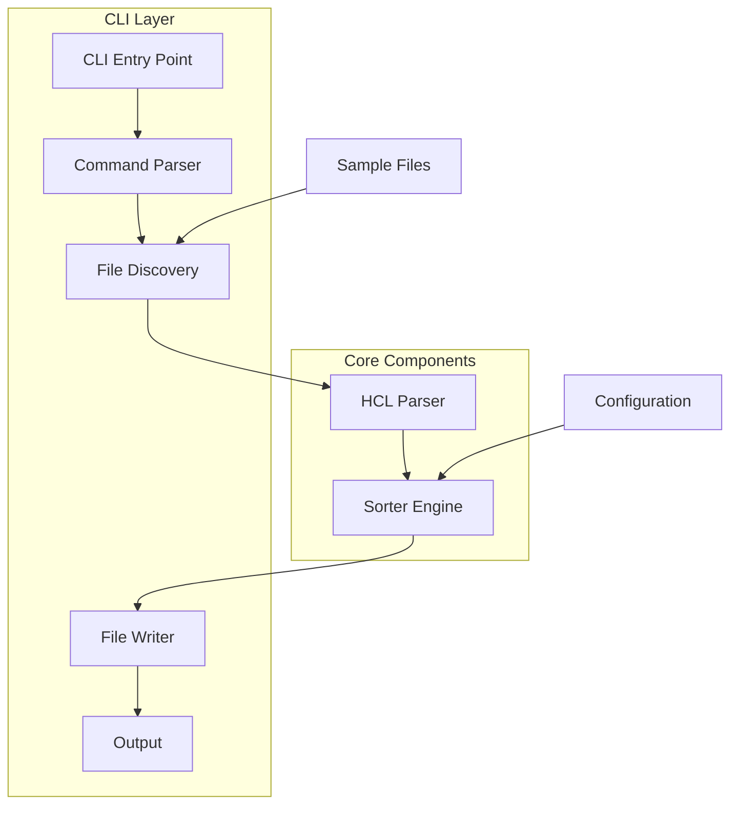
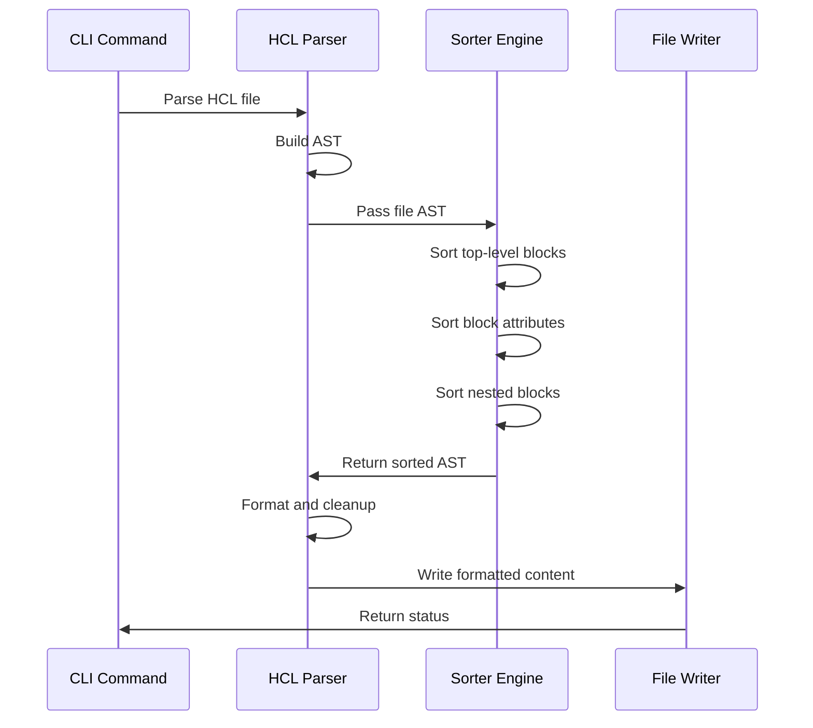

# Architecture Documentation

## Overview

Tofusort is a command-line tool designed to sort Terraform/OpenTofu configuration files alphabetically. The architecture follows Go best practices with a clean separation of concerns between CLI handling, parsing, and sorting logic.

## System Architecture



## Component Overview

### 1. CLI Layer (`cmd/tofusort/`)

**Purpose**: Handle command-line interface, file operations, and user interaction.

**Components**:
- `main.go`: Application entry point and root command setup
- `sort.go`: Sort command implementation with file discovery and processing
- `check.go`: Check command for CI/CD validation

**Responsibilities**:
- Parse command-line arguments using Cobra
- Discover files (single file, directory, recursive)
- Coordinate parsing and sorting operations
- Handle dry-run mode and output formatting
- Manage error reporting and exit codes

### 2. Parser Layer (`internal/parser/`)

**Purpose**: Handle HCL file parsing and formatting integration.

**Components**:
- `parser.go`: HCL parsing and formatting logic

**Responsibilities**:
- Parse HCL files using `github.com/hashicorp/hcl/v2/hclwrite`
- Integrate with `tofu fmt` for consistent formatting
- Handle both `.tf` and `.tfvars` files
- Preserve comments and expressions
- Clean up excessive blank lines

**Key Features**:
- AST-based parsing for reliable handling
- Comment preservation
- Expression integrity maintenance
- Format cleanup and standardization

### 3. Sorter Engine (`internal/sorter/`)

**Purpose**: Core sorting logic for Terraform constructs.

**Components**:
- `sorter.go`: Main sorting implementation
- `sorter_test.go`: Comprehensive test suite

**Responsibilities**:
- Sort top-level blocks by type and name
- Sort attributes within blocks
- Handle meta-arguments (count, for_each, lifecycle, depends_on)
- Sort nested blocks recursively
- Manage spacing and formatting rules

**Advanced Features**:
- **Validation Block Sorting**: Sort by `error_message` content
- **Dynamic Block Sorting**: Sort by label name, then `for_each` expression
- **Attribute Categorization**: Early, regular, and late attributes
- **Spacing Management**: Single-line vs multi-line attribute handling

## Data Flow



## Sorting Algorithm

### Block Type Hierarchy
```
terraform (0) → provider (1) → variable (2) → locals (3) → 
data (4) → resource (5) → module (6) → output (7)
```

### Attribute Sorting Rules

1. **Early Meta-Arguments** (order: 0-499)
   - `count` (0)
   - `for_each` (1)

2. **Regular Attributes** (alphabetical)

3. **Late Meta-Arguments** (order: 998+)
   - `lifecycle` (998)
   - `depends_on` (999)

### Special Block Handling

- **Validation Blocks**: Sorted by `error_message` content
- **Dynamic Blocks**: Sorted by label name, then `for_each` expression
- **Lifecycle Blocks**: Always appear last within their parent

## File Structure

```
tofusort/
├── cmd/tofusort/           # CLI application
│   ├── main.go            # Entry point and root command
│   ├── sort.go            # Sort command implementation
│   └── check.go           # Check command implementation
├── internal/              # Internal packages
│   ├── parser/            # HCL parsing logic
│   │   └── parser.go
│   └── sorter/            # Sorting algorithms
│       ├── sorter.go      # Main sorting logic
│       └── sorter_test.go # Test suite
├── sample/                # Test Terraform files
├── go.mod                 # Go module definition
├── .mise.toml            # Development environment
└── docs/                 # Documentation
    ├── README.md
    ├── CLAUDE.md
    └── ARCHITECTURE.md
```

## Key Design Decisions

### 1. AST-Based Parsing
- Uses `hclwrite` package for reliable AST manipulation
- Preserves all formatting, comments, and expressions
- Enables precise sorting without breaking Terraform syntax

### 2. Recursive Sorting
- Sorts nested blocks using the same rules as top-level blocks
- Maintains consistency across all nesting levels
- Special handling for validation and dynamic blocks

### 3. Spacing Management
- Groups single-line attributes together
- Adds blank lines before multi-line attributes and nested blocks
- Preserves original formatting intentions while enforcing consistency

### 4. Error Recovery
- Continues processing other files if one fails
- Provides detailed error reporting with file and line context
- Graceful handling of parsing errors

## Performance Considerations

- **Memory Efficiency**: Processes files individually to minimize memory usage
- **Concurrent Processing**: Ready for parallel file processing (future enhancement)
- **AST Reuse**: Minimal AST manipulation for better performance

## Extension Points

The architecture supports several future enhancements:

1. **Object Literal Sorting**: Framework exists for expression-level sorting
2. **Custom Sort Orders**: Configuration system can be added
3. **Plugin System**: Sorter interface allows for custom sorting rules
4. **Format Integration**: Parser layer abstracts formatting concerns

## Dependencies

- `github.com/hashicorp/hcl/v2`: HCL parsing and manipulation
- `github.com/spf13/cobra`: CLI framework
- Standard Go library for file operations and string manipulation

## Testing Strategy

- **Unit Tests**: Comprehensive coverage for sorting logic
- **Integration Tests**: Sample files validate end-to-end functionality
- **Regression Tests**: Ensure changes don't break existing functionality